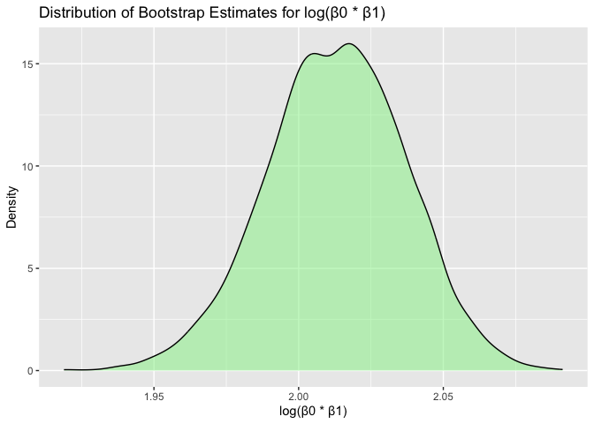
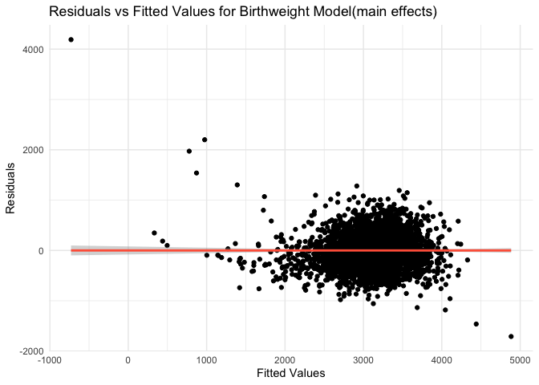

p8105_hw6_iah2124
================
Iris Hart
2024-12-02

## Problem 1

Loading the weather data

``` r
weather_df = 
  rnoaa::meteo_pull_monitors(
    c("USW00094728"),
    var = c("PRCP", "TMIN", "TMAX"), 
    date_min = "2017-01-01",
    date_max = "2017-12-31") %>%
  mutate(
    name = recode(id, USW00094728 = "CentralPark_NY"),
    tmin = tmin / 10,
    tmax = tmax / 10) %>%
  select(name, id, everything())
```

    ## using cached file: /Users/irishart/Library/Caches/org.R-project.R/R/rnoaa/noaa_ghcnd/USW00094728.dly

    ## date created (size, mb): 2024-10-29 08:13:52.67168 (8.656)

    ## file min/max dates: 1869-01-01 / 2024-10-31

Set up the bootstrapping process

``` r
set.seed(123)  

n_bootstrap <- 5000
```

Creating a function to perform regression and extract required metrics

``` r
bootstrap_results <- replicate(n_bootstrap, {
  sample_data <- weather_df %>% sample_frac(replace = TRUE)
  
  lm_fit <- lm(tmax ~ tmin, data = sample_data)
  
  r_squared <- glance(lm_fit)$r.squared
  
  coef_values <- tidy(lm_fit)
  
  beta_0 <- coef_values$estimate[1]
  beta_1 <- coef_values$estimate[2]
  log_beta_prod <- log(beta_0 * beta_1)
  
  c(r_squared = r_squared, log_beta_prod = log_beta_prod)
}, simplify = TRUE)

bootstrap_df <- as.data.frame(t(bootstrap_results))
colnames(bootstrap_df) <- c("r_squared", "log_beta_prod")
```

Plot the distribution of r_squared

``` r
ggplot(bootstrap_df, aes(x = r_squared)) +
  geom_density(fill = "skyblue", alpha = 0.5) +
  labs(title = "Distribution of Bootstrap Estimates for r^2", x = "r^2", y = "Density")
```

<!-- -->
The ditribution of r_squared is approximately normally distributed with
a 95% confidence interval of 0.8945701 , 0.9271042.

Plot the distribution of log(β0 \* β1)

``` r
ggplot(bootstrap_df, aes(x = log_beta_prod)) +
  geom_density(fill = "lightgreen", alpha = 0.5) +
  labs(title = "Distribution of Bootstrap Estimates for log(β0 * β1)", x = "log(β0 * β1)", y = "Density")
```

<!-- -->
The distribution of log(β0 \* β1) is approximately normally distributed
with a 95% confidence interval of 1.964166 , 2.058364.

Calculate 95% Confidence Intervals

``` r
ci_r_squared <- quantile(bootstrap_df$r_squared, c(0.025, 0.975))
ci_log_beta_prod <- quantile(bootstrap_df$log_beta_prod, c(0.025, 0.975))

cat("95% Confidence Interval for r^2: [", ci_r_squared[1], ", ", ci_r_squared[2], "]\n")
```

    ## 95% Confidence Interval for r^2: [ 0.8945701 ,  0.9271042 ]

``` r
cat("95% Confidence Interval for log(β0 * β1): [", ci_log_beta_prod[1], ", ", ci_log_beta_prod[2], "]\n")
```

    ## 95% Confidence Interval for log(β0 * β1): [ 1.964166 ,  2.058364 ]

## Problem 2

Load data and filter out city states and races unneeded

``` r
homicide_df <- read_csv("homicide-data.csv") |>

  mutate(city_state = paste(city, state, sep = ",")) |>  

  filter(!(city_state %in% c("Dallas,TX", "Phoenix,AZ", "Kansas City,MO", "Tulsa,AL"))) |> 

  mutate(
    solved = case_when(
      disposition == "Closed without arrest" ~ 1,
      disposition == "Open/No arrest" ~ 0, 
      disposition == "Closed by arrest" ~ 1,
      TRUE ~ NA_real_  
    )
  ) |> 

  filter(victim_race %in% c("White", "Black")) |>  

  mutate(
    victim_age = as.numeric(victim_age)  
  )
```

    ## Rows: 52179 Columns: 12
    ## ── Column specification ────────────────────────────────────────────────────────
    ## Delimiter: ","
    ## chr (9): uid, victim_last, victim_first, victim_race, victim_age, victim_sex...
    ## dbl (3): reported_date, lat, lon
    ## 
    ## ℹ Use `spec()` to retrieve the full column specification for this data.
    ## ℹ Specify the column types or set `show_col_types = FALSE` to quiet this message.

    ## Warning: There was 1 warning in `mutate()`.
    ## ℹ In argument: `victim_age = as.numeric(victim_age)`.
    ## Caused by warning:
    ## ! NAs introduced by coercion

``` r
view(homicide_df)
```

Calculating the estimate and confidence interval of the adjusted odds
ratio for solving homicides comparing male victims to female victims
keeping all other variables fixed.

``` r
baltimore_df <- homicide_df |>
  filter(city_state == "Baltimore,MD")

baltimore_reg <- glm(
  solved ~ victim_age + victim_sex + victim_race, 
  data = baltimore_df, 
  family = binomial()  
)

baltimore_OR <- broom::tidy(baltimore_reg) |>
  mutate(
    OR = exp(estimate), 
    CI_upper = exp(estimate + 1.96 * std.error),  
    CI_lower = exp(estimate - 1.96 * std.error)   
  ) |>
  filter(term == "victim_sexMale") |>
  select(OR, CI_lower, CI_upper)  

baltimore_OR
```

    ## # A tibble: 1 × 3
    ##      OR CI_lower CI_upper
    ##   <dbl>    <dbl>    <dbl>
    ## 1 0.355    0.268    0.469

Calculating ORs for each city listed

``` r
allcity_ORresults <- homicide_df |>
  nest(data = -city_state) |>
  mutate(
    model = map(data, ~ glm(solved ~ victim_age + victim_sex + victim_race, data = .x, family = binomial())), 
    tidy_model = map(model, broom::tidy)
  ) |>
  select(-model, -data) |>
  unnest(cols = tidy_model) |>
  mutate(
    OR = exp(estimate), 
    CI_upper = exp(estimate + 1.96 * std.error),  
    CI_lower = exp(estimate - 1.96 * std.error)   
  ) |>
  filter(term == "victim_sexMale") |>
  select(city_state, OR, CI_upper, CI_lower)

allcity_ORresults |>
  knitr::kable(digits = 4)
```

| city_state        |     OR | CI_upper | CI_lower |
|:------------------|-------:|---------:|---------:|
| Albuquerque,NM    | 0.4301 |   1.2528 |   0.1476 |
| Atlanta,GA        | 0.5121 |   0.7993 |   0.3281 |
| Baltimore,MD      | 0.3547 |   0.4691 |   0.2681 |
| Baton Rouge,LA    | 0.3188 |   0.6117 |   0.1661 |
| Birmingham,AL     | 0.7040 |   1.1026 |   0.4495 |
| Boston,MA         | 0.6740 |   1.2760 |   0.3560 |
| Buffalo,NY        | 0.4382 |   0.7963 |   0.2412 |
| Charlotte,NC      | 0.3008 |   0.5982 |   0.1513 |
| Chicago,IL        | 0.3908 |   0.4760 |   0.3209 |
| Cincinnati,OH     | 0.2055 |   0.4077 |   0.1036 |
| Columbus,OH       | 0.3606 |   0.5288 |   0.2458 |
| Denver,CO         | 0.1866 |   0.5043 |   0.0690 |
| Detroit,MI        | 0.5522 |   0.6961 |   0.4380 |
| Durham,NC         | 0.4501 |   1.0508 |   0.1928 |
| Fort Worth,TX     | 0.3514 |   0.6381 |   0.1936 |
| Fresno,CA         | 1.1289 |   2.6999 |   0.4720 |
| Houston,TX        | 0.5439 |   0.7112 |   0.4160 |
| Indianapolis,IN   | 0.5672 |   0.7939 |   0.4052 |
| Jacksonville,FL   | 0.5524 |   0.7614 |   0.4008 |
| Las Vegas,NV      | 0.3556 |   0.5366 |   0.2356 |
| Long Beach,CA     | 0.1650 |   0.7275 |   0.0374 |
| Los Angeles,CA    | 0.6619 |   0.9563 |   0.4581 |
| Louisville,KY     | 0.4906 |   0.7897 |   0.3047 |
| Memphis,TN        | 0.4856 |   0.6914 |   0.3411 |
| Miami,FL          | 0.3575 |   0.6180 |   0.2068 |
| Milwaukee,wI      | 0.5268 |   0.7976 |   0.3479 |
| Minneapolis,MN    | 1.0752 |   2.1462 |   0.5387 |
| Nashville,TN      | 0.6822 |   1.0920 |   0.4262 |
| New Orleans,LA    | 0.4146 |   0.5761 |   0.2984 |
| New York,NY       | 0.1613 |   0.3497 |   0.0744 |
| Oakland,CA        | 0.5631 |   0.8684 |   0.3651 |
| Oklahoma City,OK  | 0.9088 |   1.4245 |   0.5798 |
| Omaha,NE          | 0.3581 |   0.6900 |   0.1858 |
| Philadelphia,PA   | 0.3242 |   0.4429 |   0.2373 |
| Pittsburgh,PA     | 0.4308 |   0.6999 |   0.2651 |
| Richmond,VA       | 0.4598 |   1.1467 |   0.1844 |
| San Antonio,TX    | 0.2878 |   0.6214 |   0.1333 |
| Sacramento,CA     | 0.3374 |   0.7988 |   0.1425 |
| Savannah,GA       | 0.5404 |   1.1543 |   0.2530 |
| San Bernardino,CA | 0.3805 |   1.1916 |   0.1215 |
| San Diego,CA      | 0.1935 |   0.5688 |   0.0658 |
| San Francisco,CA  | 0.6075 |   1.1651 |   0.3168 |
| St. Louis,MO      | 0.5641 |   0.7520 |   0.4231 |
| Stockton,CA       | 1.0546 |   2.3110 |   0.4812 |
| Tampa,FL          | 0.5510 |   1.3508 |   0.2248 |
| Tulsa,OK          | 0.7025 |   1.2315 |   0.4008 |
| Washington,DC     | 0.4711 |   0.7291 |   0.3044 |

Creating a plot to display OR data

``` r
ggplot(allcity_ORresults, aes(x = reorder(city_state, OR), y = OR, ymin = CI_lower, ymax = CI_upper)) +
  geom_pointrange() +
  labs(
    title = "Estimated Odds Ratios for Solving Homicides: Male vs Female Victims",
    x = "City, State",
    y = "Odds Ratio (OR)",
    caption = "Whiskers represent 95% confidence intervals"
  ) +
  theme_minimal() +
  theme(
    axis.text.y = element_text(size = 8),  
    axis.title = element_text(size = 10),  
    axis.text.x = element_text(size = 7, angle = 45, hjust = 1)  
  )
```

<!-- -->
The estimated odds ratios for solving homicides for male vs. female
victims is typically less than 1 for most cities. This indicates that
more male victims are less likely compared to female victims to have a
resolved homicide case. However, in Stockton, CA, Minneapolis, MN, and
Fresno, CA, male victims are more likely to have a resolved homicide
case than females.

## Problem 3

Loading and cleaning birthweight data

``` r
birthweight_df = read_csv("birthweight.csv") |> 
  mutate(babysex = as.factor(babysex),
         frace = as.factor(frace),
         malform = as.factor(malform),
         mrace = as.factor(mrace)
         )
```

    ## Rows: 4342 Columns: 20
    ## ── Column specification ────────────────────────────────────────────────────────
    ## Delimiter: ","
    ## dbl (20): babysex, bhead, blength, bwt, delwt, fincome, frace, gaweeks, malf...
    ## 
    ## ℹ Use `spec()` to retrieve the full column specification for this data.
    ## ℹ Specify the column types or set `show_col_types = FALSE` to quiet this message.

``` r
view(birthweight_df)
```

View the data in a visual layout

``` r
ggplot(birthweight_df, aes(x = bwt, y = blength)) + 
  geom_point(color = "coral") +   
  theme_minimal()
```

<!-- -->

Propose the hypothetical fit model

``` r
hypotheticalrg_model <- lm(bwt ~ blength + bhead + babysex + gaweeks + delwt + fincome + 
                            smoken + wtgain + momage + mheight + parity, data = birthweight_df)

birthweight_df |> 
  add_predictions(hypotheticalrg_model) |>
  add_residuals(hypotheticalrg_model) |>
  ggplot(aes(x = pred, y = resid)) + 
  geom_point() + 
  geom_smooth(method = "lm", color = "lightgreen") + 
  theme_minimal() +
  labs(
    title = "Residuals vs Fitted Values for Birthweight Model(full model)", 
    x = "Fitted Values", 
    y = "Residuals"
  )
```

    ## `geom_smooth()` using formula = 'y ~ x'

<!-- -->
In order to create a model, factors such as baby’s length at birth,
baby’s head circumference at birth, baby’s sex, gestational age in
weeks, mother’s weight at delivery, monthly financial income for the
family, average number of cigarettes smoked per day during preganncy,
mothers weight gain during pregnancy, mothers age at delivery, mothers
height, and number of live births prior to this birth were used since
they would likely have an impact on the birth weight of the baby.

Main effects fitted model

``` r
maineffects_model <- lm(bwt ~ blength + gaweeks, data = birthweight_df)

birthweight_df |>
  add_predictions(maineffects_model) |>
  add_residuals(maineffects_model) |>
  ggplot(aes(x = pred, y = resid)) + 
  geom_point() + 
  geom_smooth(method = "lm", color = "tomato") + 
  theme_minimal() +
  labs(
      title = "Residuals vs Fitted Values for Birthweight Model(main effects)", 
      x = "Fitted Values", y = "Residuals"
      )
```

    ## `geom_smooth()` using formula = 'y ~ x'

<!-- -->
Interaction fitted model

``` r
interaction_model <- lm(bwt ~ bhead * blength * babysex + gaweeks + delwt + smoken + 
                          wtgain + momage + mheight, data = birthweight_df)

birthweight_df |>
  add_predictions(interaction_model) |>
  add_residuals(interaction_model) |>
  ggplot(aes(x = pred, y = resid)) + 
  geom_point() + 
  geom_smooth(method = "lm", color = "orchid") + 
  theme_minimal() +
  labs(
    title = "Residuals vs Fitted Values for Birthweight Model(interaction)", 
      x = "Fitted Values", y = "Residuals"
      )
```

    ## `geom_smooth()` using formula = 'y ~ x'

<!-- -->

Making comparisons between models

``` r
cv_df <- crossv_mc(birthweight_df, 100) |> 
  mutate(
    train = map(train, as_tibble),
    test = map(test, as_tibble)
  )

cv_res_df <- cv_df |> 
  mutate(
    hypotheticalrg_model = map(train, \(x) lm(bwt ~ blength + bhead + gaweeks + delwt + fincome + 
                                              smoken + wtgain + momage + mheight + parity, data = x)),
    maineffects_model = map(train, \(x) lm(bwt ~ blength + gaweeks, data = x)),
    interaction_model = map(train, \(x) lm(bwt ~ bhead * blength * babysex + gaweeks + delwt + smoken + 
                                             wtgain + momage + mheight, data = x))
  ) |> 
  mutate(
    rmse_hypothetical = map2_dbl(hypotheticalrg_model, test, rmse),
    rmse_main_effects = map2_dbl(maineffects_model, test, rmse),
    rmse_interaction = map2_dbl(interaction_model, test, rmse)
  )
```

    ## Warning: There were 3 warnings in `mutate()`.
    ## The first warning was:
    ## ℹ In argument: `rmse_hypothetical = map2_dbl(hypotheticalrg_model, test,
    ##   rmse)`.
    ## Caused by warning in `predict.lm()`:
    ## ! prediction from rank-deficient fit; attr(*, "non-estim") has doubtful cases
    ## ℹ Run `dplyr::last_dplyr_warnings()` to see the 2 remaining warnings.

Plotting comparisons - Villon plot

``` r
cv_res_df |> 
  select(starts_with("rmse")) |> 
  pivot_longer(
    everything(),
    names_to = "model", 
    values_to = "rmse",
    names_prefix = "rmse_"
  ) |> 
  ggplot(aes(x = model, y = rmse)) + 
  geom_violin() + 
  theme_minimal() +
  labs(x = "Model", y = "RMSE")
```

<!-- -->
The hypothetical model has a low RMSE and is pretty evenly distributed,
making it a great model to use. The interaction model also has a low
RMSE, but there is less even distribution in this model, meaning it
would be a good but not great model. The main effect model has a much
higher RMSE and is not very evenly distributed, making it a poor model
to use.
